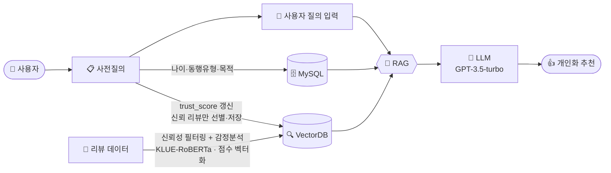

<div align="center">

# 📔 Personalized Tour AI — 포트폴리오

### 개인맞춤형 관광을 위한 LLM × RAG 기반 신뢰도 리뷰 추천 시스템

*"믿을 수 있는 리뷰만 골라, 당신에게 꼭 맞는 부산 여행을 추천한다"*

</div>

---

## 📌 한 줄 소개

97,239건의 관광 리뷰를 수집·정제하고, **리뷰 신뢰도를 정량 평가**한 뒤,
신뢰 리뷰만으로 **RAG + GPT-3.5** 기반 개인 맞춤 여행 추천을 제공하는 **AI 풀스택 시스템**.

---

## 🗂️ 프로젝트 개요

| 항목 | 내용 |
|------|------|
| **프로젝트명** | Personalized Tour AI (개인맞춤형 관광 추천 시스템) |
| **유형** | 졸업작품 / 팀 프로젝트 |
| **기간** | 2025.04 ~ 2025.07 (핵심 개발 4~6월, 7월 하계학술대회 발표) |
| **핵심 주제** | 리뷰 신뢰도 평가 + RAG 기반 개인화 추천 |
| **대상 도메인** | 부산 지역 관광·소상공인 |
| **결과물** | 데이터 파이프라인(수집→추천) + 모바일 앱 서비스 |
| **데이터 규모** | 리뷰 97,239건 (신뢰 리뷰 19,257건) |
| **기술 스택** | Python · PyTorch · KLUE-RoBERTa · XGBoost · sentence-transformers · ChromaDB · OpenAI GPT-3.5 · FastAPI · Spring Boot · JPA · MySQL · React Native · Expo · Docker · AWS EC2 |

---

## 🎯 문제 정의 (Why)

기존 관광 서비스와 온라인 리뷰에는 세 가지 한계가 있었습니다.

1. **대형 관광지 편중** — 부산투어패스 등은 유명 관광지 중심이라 지역 소상공인이 소외됨
2. **리뷰의 낮은 신뢰성** — 광고성·성의 없는 리뷰가 섞여 있어 어떤 리뷰를 믿어야 할지 알기 어려움
3. **개인화 부재** — 나이·동행·목적이 다른데도 모두 같은 추천을 받음

> 💬 **핵심 질문**: *"어떻게 하면 '믿을 수 있는 리뷰'만 걸러, 사용자마다 다른 맞춤 추천을 줄 수 있을까?"*

이를 위해 **리뷰 신뢰도를 수치화(trust_score)** 하고, 신뢰 리뷰만 벡터화하여 **RAG로 검색 + LLM으로 개인화 응답**을 생성하는 파이프라인을 설계했습니다.

---

## 🏗️ 시스템 아키텍처



**흐름 요약**
- **① 사전 준비(오프라인)**: 리뷰 데이터 → 신뢰성 필터링 + 감정분석(KLUE-RoBERTa) + 점수 벡터화 → **VectorDB** 저장
- **② 개인화**: 사용자 사전질의 → 프로필(나이·동행·목적)은 **MySQL**, 신뢰 기준은 **trust_score 갱신**으로 VectorDB 재선별
- **③ 추천**: 사용자 질의 입력 → **RAG**가 MySQL(프로필) + VectorDB(유사 신뢰 리뷰)를 함께 조회 → **LLM(GPT-3.5)** → 개인화 추천

---

## 🧑‍💻 담당 역할 & 기여

> 아래는 프로젝트에서 수행한 작업 범위입니다. *(팀 내 실제 담당 파트에 맞게 조정하세요.)*

| 파트 | 기여 내용 |
|------|----------|
| **데이터 수집** | Google Places API·Selenium 크롤러 설계, 부산 전역 9.7만 건 리뷰 수집·중복 제거 |
| **전처리** | 상대시간→절대날짜 변환, 이모지 한글화, 이종 데이터 규격 통일·병합 |
| **감정 분석** | KLUE-RoBERTa NSMC 파인튜닝, 긴 리뷰 길이 적응형(청크 가중평균) 처리 |
| **신뢰도 모델** | trust_score 가중합 설계, XGBoost 학습·저장 |
| **벡터 DB / RAG** | multilingual-e5 임베딩, ChromaDB 구축, 검색 파이프라인 |
| **백엔드 / 앱 연동** | FastAPI RAG API, Spring 중계 로직, 설문 기반 개인화 재구축 |

---

## 🔬 기술적 하이라이트 (How)

### 1️⃣ 리뷰 신뢰도를 수치로 — `trust_score`

리뷰의 "믿을 만함"을 5개 정량 지표의 **가중합**으로 정의했습니다.

```
trust_score = 0.20·리뷰길이 + 0.30·작성자 활동성 + 0.25·감정 + 0.20·사진유무 + 0.05·최신성
신뢰라벨   = 1  if  trust_score ≥ 0.6  else  0
```

| 지표 | 근거 |
|------|------|
| 리뷰 길이 | 길수록 구체적 경험 → 신뢰 ↑ |
| 작성자 활동성 | 리뷰를 많이 쓴 사용자일수록 신뢰 ↑ |
| 감정 점수 | 극단·모호한 감정보다 명확한 긍정 신호 반영 |
| 사진 유무 | 사진 첨부 = 실제 방문 근거 |
| 최신성 | 최근 리뷰일수록 현재 상태 반영 |

→ 9.7만 건 중 **19,257건(19.8%)** 이 신뢰 리뷰로 선별되었습니다.

<br/>

### 2️⃣ 규칙 라벨을 학습하는 XGBoost

`trust_score ≥ 0.6` 규칙으로 만든 라벨을 **XGBoost가 일반화**하도록 학습시켰습니다.

```python
X = df[['리뷰길이_점수','작성자리뷰수_점수','날짜_최신성_점수','감정분석_점수','사진유무']]
y = df['신뢰라벨']
model = XGBClassifier(eval_metric='logloss').fit(X_train, y_train)
```

> 💡 규칙 기반 라벨링은 투명하지만 경직됩니다. 이를 ML로 근사하면, **신규 리뷰를 5개 지표만으로 즉시 판정**할 수 있는 재사용 가능한 모델을 얻습니다.

<br/>

### 3️⃣ 긴 리뷰를 놓치지 않는 감정 분석

KLUE-RoBERTa(`klue/roberta-base`)를 **NSMC(네이버 영화리뷰) 20만 건**으로 파인튜닝했고(RTX 3090), 긴 리뷰는 토큰 한계로 감정이 왜곡되므로 **길이 적응형 청크 처리**로 해결했습니다.

**📈 학습 결과 (최종 정확도 90.9%)**

| Epoch | Training Loss | Validation Loss | Accuracy |
|:---:|:---:|:---:|:---:|
| 1 | 0.2679 | 0.2459 | 90.19% |
| 2 | 0.1838 | 0.2589 | 90.84% |
| 3 | 0.1530 | 0.3385 | **90.94%** |

*학습 설정: train 150,000 / test 50,000, epochs 3, batch 16, max 256 토큰, CrossEntropyLoss*

```
predict_sentiment("진짜 너무 맛있고 친절했어요!")  → {'label': '긍정', 'confidence': 0.9975}
predict_sentiment("별로예요. 다시는 안 가요.")     → {'label': '부정', 'confidence': 0.9985}
```

**길이 적응형 처리**

| 토큰 길이 | 처리 |
|:---:|---|
| ≤ 256 | 그대로 추론 |
| 256~512 | 청크 분할 후 평균 |
| > 512 | 청크 분할 후 **길이 가중평균** |

> 💡 단순 평균이 아닌 **길이 가중평균**으로, 긴 청크의 감정이 더 큰 비중을 갖도록 하여 왜곡을 줄였습니다.

<br/>

### 4️⃣ 사용자 설문이 곧 추천을 바꾸는 — 동적 벡터 DB 재구축

가장 차별적인 부분입니다. 사용자가 *"나는 이런 리뷰를 신뢰한다"* 를 설문으로 고르면, 그 선호가 **trust_score 가중치**가 되어 벡터 DB가 개인에 맞게 다시 만들어집니다.

```
설문 → Spring(가중치 정규화, 합=1) → FastAPI
   ① trust_score 재계산  ② 신뢰라벨 재부여
   ③ 신뢰 리뷰 재임베딩(500 배치·GPU)  ④ ChromaDB 컬렉션 재생성
```

> 💡 가중치를 **합=1로 정규화**해 어떤 조합이든 점수 스케일이 유지되도록 했고, 임베딩·삽입을 **배치 처리**해 메모리·요청 한도 문제를 회피했습니다.

<br/>

### 5️⃣ RAG + LLM으로 개인화 응답

```
질문 → e5 임베딩(query:) → ChromaDB top-3 신뢰 리뷰 → 프롬프트(사용자 정보+리뷰) → GPT-3.5
```

프롬프트에 **리뷰 페이지 URL과 trust_score를 함께 주입**해, 응답에 원본 리뷰 링크와 신뢰 근거가 담기도록 유도했습니다.

---

## 🧩 트러블슈팅 & 의사결정

| 상황 | 해결 |
|------|------|
| **긴 리뷰 감정 왜곡** (512 토큰 초과) | 청크 분할 + 길이 가중평균 |
| **이모지가 감정분석 노이즈** | 이모지 30여 종을 한글 감정어로 사전 치환 |
| **이종 데이터 규격 불일치** (구글/카카오) | 카카오 규격 기준 통일 → 컬럼 매핑 → 중복 검사 후 병합 |
| **API로 못 얻는 필드** (사진·업종·총리뷰수) | Selenium 크롤링으로 보강, 행 단위 즉시 저장으로 유실 방지 |
| **대량 임베딩 OOM/요청 한도** | 500개 배치 분할 처리 |
| **E5 검색 품질 저하** | 문서 `passage:` / 질의 `query:` prefix 규칙 적용 |
| **재구축 대기시간 UX** | 앱에 "리뷰 데이터 최적화 중" 로딩 모달 노출 |

---

## 📊 성과 & 결과

<div align="center">

| 📦 수집 리뷰 | ✅ 신뢰 리뷰 | 💚 감정분석 정확도 | ☁️ 배포 |
|:---:|:---:|:---:|:---:|
| **97,239건** | **19,257건 (19.8%)** | **90.9%** | AWS EC2 (GPU) |

</div>

- 감정 분석 모델(KLUE-RoBERTa fine-tuned) **최종 정확도 90.9%**, 예측 신뢰도(confidence) 0.99+
- 리뷰 신뢰도 평가 파이프라인 **엔드투엔드 구현** (수집 → 추천)
- 사용자 설문 기반 **개인화된 벡터 DB 재구축** 기능 완성
- 3개 컨테이너(Expo·Spring·FastAPI) **연동 서비스** 동작

**🎬 실제 추천 결과** — *"혼자 갈 맛집을 알려줘"* 질의 시:
> 신뢰 리뷰 기반으로 **부산 여행지 3곳**(대장양곱탕·해적·임관계순감국수 초장집 등)을
> 별점·총평점·리뷰 내용·**원본 리뷰 링크**와 함께 추천 → RAG + LLM 파이프라인 정상 동작 확인

*🏆 2025 하계학술대회(동서대 Soft Artificial Life) 발표*

---

## 🛠️ 기술 스택

```
수집        Python · Google Places API · Selenium
전처리      pandas · dateutil
감정분석    KLUE-RoBERTa(NSMC fine-tuned) · transformers · PyTorch
신뢰도      XGBoost · scikit-learn · joblib
임베딩/검색  sentence-transformers(multilingual-e5-base) · ChromaDB
LLM         OpenAI GPT-3.5-turbo
프론트엔드   React Native · Expo Router
백엔드      Spring Boot · JPA · MySQL
AI 서버     FastAPI · uvicorn
인프라      Docker · AWS EC2(GPU · CUDA 12.1)
```

---

## 🧠 배운 점 (Learnings)

- **"신뢰"라는 추상 개념을 정량화**하는 경험 — 도메인 직관을 지표·가중치로 번역하고, 규칙을 ML로 근사하는 설계를 익혔습니다.
- **RAG의 검색 품질이 응답 품질을 좌우**한다는 점 — 임베딩 모델의 prefix 규칙, 신뢰 리뷰 필터링이 최종 추천에 직접적으로 반영됨을 확인했습니다.
- **AI 모델을 서비스로 잇는 전 과정** — 모델 추론을 FastAPI로 감싸고, Spring이 중계하고, 앱이 소비하는 **풀스택 통합**을 경험했습니다.
- **데이터 품질이 8할** — 수집·전처리 단계의 정제가 이후 모든 모델 성능을 결정한다는 것을 체감했습니다.

---

## 🔭 향후 개선 방향

- [ ] 클래스 불균형 보정 (`scale_pos_weight`) 및 교차검증으로 신뢰도 모델 강화
- [ ] 사용자별 컬렉션 분리 · 임베딩 캐시로 **재구축 비용 절감**
- [ ] GPT-4o 등 상위 모델 및 응답 평가(RAGAS) 도입
- [ ] 하드코딩 경로 → 설정 파일화, `docker-compose`로 오케스트레이션 정리
- [ ] 로그인·다중 사용자 지원 (현재 `userId` 고정)

---

# 🔧 문제 해결 상세 (Case Studies)

---

## 1. 길이 적응형 청크 분할 및 가중평균 적용을 통한 리뷰 감정 분석 정확도 확보

### 문제 상황

- 감정 분석은 KLUE-RoBERTa(`klue/roberta-base`)를 **NSMC(네이버 영화리뷰) 20만 건으로 파인튜닝**해 사용. NSMC 리뷰가 대체로 짧은 단문이고 Transformer의 attention 연산량이 입력 길이의 제곱에 비례하는 점을 고려해, 학습·추론의 **입력 길이를 256 토큰으로 설정**함 (모델 구조상 최대는 512 토큰이나 실효 상한을 256으로 둠)
- 그러나 관광 리뷰는 영화 리뷰보다 길어 이 256 토큰을 초과하는 경우가 있고, 초과분을 단순히 잘라내면(truncation) 리뷰 후반부의 부정적 반전 신호가 유실되어 감정 점수가 왜곡됨
- 감정 점수는 trust_score의 한 항목(가중치 0.25)으로 쓰이므로, 이 왜곡이 신뢰도 평가 전반의 품질에 영향을 줌

### 해결 과정

1. **문제 원인을 측정으로 특정**
    - `review_text_long_length.py`로 리뷰 길이 분포와 최장 리뷰를 확인
    - 전체가 아니라 **소수의 초장문 리뷰**가 256 토큰을 초과해 잘리는 것이 원인임을 데이터로 확인

2. **가장 단순한 대안("max_length를 512로 확대")을 먼저 검토 후 배제**
    - 입력 상한을 512로 늘리는 방법을 우선 고려했으나, 아래 이유로 채택하지 않음
        - 학습 데이터(NSMC)가 짧아 512 구간을 학습한 적이 없어 **정확도 이득이 없음**
        - **512를 초과하는 리뷰도 존재**해 상한만 늘려서는 근본 해결이 안 됨
        - attention 연산량이 길이의 제곱으로 늘어 **비용만 증가**
    - 결론: "상한 확대"가 아니라 **"긴 입력을 모델이 신뢰하는 길이로 분할"** 하는 방향으로 결정

3. **토큰 길이 기준 적응형 분기 설계**
    - `tokenizer.encode`로 실제 토큰 수를 계산(글자 수가 아닌 토큰 기준으로 분기)
    - **256 토큰 이하는 그대로 추론**, 초과 시 **256 토큰 단위 청크로 분할**해 각 청크를 개별 추론

4. **청크 점수 집계 방식을 단순 평균에서 길이 가중평균으로 전환**
    - 청크별 점수를 단순 평균하면 짧은 청크와 긴 청크가 동일 비중을 가져 왜곡 발생
    - `np.average(scores, weights=lengths)`로 **긴 청크에 더 큰 비중**을 부여해 원문 비율에 맞게 감정 점수를 합산

### 결과

- 감정 분석 모델 **최종 정확도 90.9%**, 예측 신뢰도(confidence) **0.99+** 달성
- 초장문 리뷰도 감정 손실 없이 점수화 → trust_score 감정 항목 신뢰도 확보

| Epoch | Training Loss | Validation Loss | Accuracy |
| --- | --- | --- | --- |
| 1 | 0.2679 | 0.2459 | 90.19% |
| 2 | 0.1838 | 0.2589 | 90.84% |
| 3 | 0.1530 | 0.3385 | **90.94%** |

*학습 환경: train 150,000 / test 50,000, epochs 3, batch 16, max 256 토큰, CrossEntropyLoss, RTX 3090*

---

## 2. 설문 기반 동적 가중치 정규화 및 벡터 DB 재구축을 통한 개인화 추천 실현

### 문제 상황

- trust_score는 5개 지표(리뷰 길이, 작성자 활동성, 감정, 사진 유무, 최신성)의 **가중합**으로 계산되고, 이 가중치가 곧 **어떤 리뷰를 "신뢰 리뷰"로 남겨 벡터 DB에 넣을지**를 결정함. 즉 가중치는 추천의 근거가 되는 리뷰 풀 자체를 좌우하는 핵심 변수임
- 그러나 초기 구조는 이 가중치를 개발자가 임의로 정한 **고정값(0.20 / 0.30 / 0.25 / 0.20 / 0.05)** 으로 두어 모든 사용자에게 동일하게 적용함
- 핵심 문제는 **"무엇을 신뢰할 만한 리뷰로 보는가"는 사용자마다 다르다**는 점임. 누군가는 사진이 있는 리뷰를, 누군가는 최신 리뷰를, 누군가는 길고 자세한 리뷰를 더 신뢰한다. 그러나 고정 가중치는 이러한 주관적 기준 차이를 전혀 반영하지 못함
- 그 결과 모든 사용자가 **동일한 trust_score → 동일한 신뢰 리뷰 집합 → 동일한 추천**을 받게 되어, 프로젝트의 핵심 목표인 '개인화 추천'이 이름뿐인 상태가 됨
- 게다가 신뢰 컷(임계값)도 고정되어 있어, 추천을 얼마나 엄격하게 혹은 관대하게 받을지조차 사용자가 조절할 수 없었음

### 해결 과정

**1. 선호를 설문으로 수집**

신뢰도 5문항(리뷰 길이, 작성자 활동성, 감정, 사진, 최신성)을 앱 설문으로 제공하고, 각 항목을 얼마나 중요하게 보는지 사용자가 선택하도록 설계했다.

**2. 선택값을 상대 비율(가중치)로 변환 — 핵심 단계**

사용자마다 선택값의 크기가 다르므로(누구는 대부분 높게, 누구는 대부분 낮게 고름) 선택값을 그대로 쓰면 trust_score의 기준이 사람마다 달라진다. 그래서 다섯 항목의 선택값을 **전체 합으로 나누어 "전체 중요도 중 각 항목이 차지하는 비율"로 변환**했다. 이렇게 하면 비율의 합이 항상 일정해져, 어떤 선택 조합에서도 trust_score가 같은 0~1 범위를 유지한다.

**3. 그 비율을 반영해 리뷰별 trust_score 재계산**

각 리뷰의 다섯 지표 점수에 사용자별 비율을 반영해 신뢰도 점수를 다시 매긴다. 그 결과 같은 리뷰라도 "무엇을 더 신뢰하는 사용자인가"에 따라 trust_score가 달라진다.

> **예시** — 어떤 리뷰가 길고 자세하지만 오래된 리뷰라면, 상세함을 중시하는 사용자에게는 신뢰 리뷰로 채택되고, 최신성을 중시하는 사용자에게는 제외될 수 있다. 즉 동일한 리뷰의 채택 여부가 사용자에 따라 달라진다.

**4. 신뢰 컷(임계값)도 사용자가 선택**

trust_score가 얼마 이상일 때 신뢰 리뷰로 볼지(70% / 60% / 50%)를 사용자가 직접 고르게 하여, 추천을 얼마나 엄격하게 또는 관대하게 받을지 조절할 수 있도록 했다.

**5. 갱신된 기준으로 벡터 DB 재구축**

FastAPI가 새 가중치와 임계값으로 trust_score와 신뢰라벨을 재계산하고, 신뢰 리뷰만 다시 임베딩하여 ChromaDB 컬렉션을 재생성한다. 이로써 사용자 선호가 곧바로 검색 대상 리뷰 풀에 반영된다.

### 결과

- 사용자 선호가 곧바로 검색 대상(신뢰 리뷰 집합)에 반영되는 **개인화 파이프라인** 완성
- 신뢰 리뷰 **19,257건(전체의 19.8%)** 이 기준에 따라 동적으로 선별됨
- 재구축 대기시간은 앱의 "리뷰 데이터 최적화 중" 로딩 모달로 UX 보완

| 구분 | 기존 | 개선 후 |
| --- | --- | --- |
| 가중치 | 고정(전 사용자 동일) | 설문 기반 개인별 정규화 가중치 |
| 신뢰 컷 | 고정(0.6) | 사용자 선택(0.5 / 0.6 / 0.7) |
| 추천 대상 | 동일 리뷰 집합 | 사용자별 재구축된 벡터 DB |

---

## 3. multilingual-e5 임베딩과 prefix 규칙 적용을 통한 의미 기반 신뢰 리뷰 검색 구축

### 문제 상황

- 사용자 질의("혼밥하기 좋은 식당")와 리뷰 본문("혼자 조용히 먹기 좋았어요")처럼 의미는 통하지만 사용하는 표현이 서로 다른 경우가 많아, 단순 키워드 매칭으로는 관련 있는 신뢰 리뷰를 찾지 못함
- 추천 품질은 결국 "질의와 의미가 가까운 리뷰를 얼마나 잘 찾느냐"에 달려 있으므로, 문장의 의미를 벡터로 비교하는 검색이 필요함

### 해결 과정

1. **임베딩 대상을 신뢰 리뷰로 한정**
    - 신뢰라벨이 1인 리뷰만 필터링하고, 본문이 비어 있는 행은 제외해 임베딩 대상을 정리

2. **임베딩 모델 선택 (trade-off 검토)**
    - **OpenAI 임베딩 API**: 품질은 우수하지만, 설문 제출마다 신뢰 리뷰 전체(약 2만 건)를 다시 임베딩하는 구조여서 호출 비용과 지연이 반복적으로 누적되는 문제가 있어 제외
    - **한국어 특화 임베딩 모델**: 리뷰에 섞여 있는 영어 표현(가게명, 메뉴명 등) 처리에 약점이 있어 제외
    - **최종 선택 — `multilingual-e5-base`**: e5 계열은 문서와 질의를 구분해 학습된 검색 특화 모델이라 이 과제(질의–리뷰 매칭)에 적합하고, 다국어 모델이라 한국어와 영어 혼용 표현도 함께 처리할 수 있음
    - **크기는 large 대신 base 선택**: 설문마다 GPU에서 전체를 재임베딩해야 하므로, 검색 품질과 임베딩 속도·메모리 사이의 균형을 고려해 base로 결정

3. **E5 접두어(prefix) 규칙 적용 (핵심)**

    `multilingual-e5`는 "질문"과 "문서"를 서로 다른 역할로 구분해 학습된 모델이라, 임베딩하기 전에 문장 앞에 역할을 알려주는 표시(접두어)를 붙여야 한다. 이를 저장과 검색 두 상황에 나누어 적용했다.

    - **리뷰를 저장할 때**: 리뷰 본문 앞에 `passage: `(문서라는 표시)를 붙여 임베딩한 뒤 ChromaDB에 저장
        ```python
        prefixed = [f"passage: {리뷰}" for 리뷰 in texts]
        embeddings = model.encode(prefixed)
        ```
    - **사용자가 검색할 때**: 질문 앞에 `query: `(질문이라는 표시)를 붙여 임베딩한 뒤 유사한 리뷰를 조회
        ```python
        query_embedding = model.encode(f"query: {질문}")
        results = collection.query(query_embeddings=[query_embedding])
        ```
    - **그 결과**: 리뷰는 "문서", 질문은 "질문"으로 올바르게 인식되어 모델이 둘을 제대로 짝지어 주므로, "혼밥"과 "혼자 먹기"처럼 표현이 달라도 의미가 가까운 리뷰를 찾아낸다. 반대로 이 접두어를 빠뜨리면 역할이 뒤섞여 유사도 계산이 어긋난다.

4. **리뷰 벡터와 메타데이터를 함께 저장**
    - 벡터 DB 구축 시, 리뷰 본문 벡터와 함께 가게명, 주소, 별점, 총평점, 작성자, trust_score, 리뷰 페이지를 메타데이터로 ChromaDB에 저장 (`collection.add`의 `metadatas`로 적재)
    - 이렇게 저장해 두면 검색 단계에서 유사 리뷰와 함께 해당 메타데이터가 그대로 반환되므로, 별도 조회 없이 추천 카드(가게 정보와 원본 링크)를 구성할 수 있도록 설계
    - 신뢰 리뷰가 대량(약 2만 건)이므로 임베딩과 삽입은 500개 단위 배치로 나누어 안정적으로 처리

5. **검색–추천 파이프라인 구성**
    - 사용자 질문을 저장 때와 동일한 모델로 임베딩해 ChromaDB에서 의미가 가장 가까운 신뢰 리뷰 **상위 3개**를 검색하도록 구현
    - 상위 3개로 제한한 것은 의도적 결정으로, 리뷰를 과도하게 넣으면 프롬프트가 길어지고 LLM이 핵심을 놓치므로 근거로 삼을 리뷰를 소수로 압축
    - 검색된 리뷰(본문과 가게 정보, 원본 링크)를 사용자 프로필과 묶어 프롬프트를 구성하고 GPT-3.5로 추천을 생성하도록 연결

### 결과 및 배운 점

- **성과**: 키워드가 정확히 일치하지 않아도 **의미가 비슷한 신뢰 리뷰를 검색**할 수 있는 구조를 확보했다. 검색 결과에 가게 정보와 원본 리뷰 링크가 함께 담겨 LLM 추천 응답에 바로 활용할 수 있었다.
- **임베딩 기반 의미 검색 이해**: 문장을 벡터로 변환해 유사도로 비교하는 검색 방식의 동작 원리를 익혔다. 특히 E5 계열의 `passage`/`query` 접두어 규칙처럼, 모델의 학습 방식을 지키는 것이 검색 정확도에 직접 영향을 준다는 점을 이해하게 되었다.
- **벡터 DB 운용 이해**: ChromaDB에 벡터와 메타데이터를 함께 저장하고 top-k로 조회하는 벡터 데이터베이스 사용 방법을 익혔다. 임베딩 결과를 추천 응답까지 연결하려면 메타데이터 설계가 중요하다는 점을 배웠다.
- **개선할 점**: 현재는 리뷰 본문을 하나의 벡터로 임베딩하므로, 긴 리뷰의 청크 단위 임베딩이나 임베딩 캐시를 도입하면 검색 정밀도와 재구축 비용을 더 개선할 수 있음을 알게 되었다.

---

## 4. API와 크롤링 하이브리드 수집 및 정제 파이프라인을 통한 통합 리뷰 데이터셋 구축

### 문제 상황

- Google Places API만으로는 **사진유무·업종·총평점·작성자 총리뷰수** 등 신뢰도 계산에 필요한 필드를 얻을 수 없음
- 구글·카카오 데이터의 규격이 다르고, 리뷰 본문에 이모지·개행 등 노이즈가 섞여 있음

### 해결 과정

1. **하이브리드 수집**
    - Places API로 기본 리뷰를 수집하고, **Selenium 크롤링**으로 API에서 빠진 필드를 보강
2. **유실 방지**
    - 크롤링은 행 단위로 즉시 CSV에 저장해, 중간 중단 시에도 데이터 손실 최소화
3. **중복 제거**
    - `(가게명·주소·작성자)` 키로 수집 단계에서 중복 필터링
4. **정제·통일·병합**
    - 상대시간("3달 전")→절대날짜 변환, 이모지 30여 종 한글 감정어 치환, 개행 제거, 업종 결측 "없음" 처리 후 카카오 규격 기준으로 병합

### 결과

- 부산 전역 **97,239건**의 통합 리뷰 데이터셋(17개 컬럼) 확보
- 신뢰도 계산에 필요한 정량 지표를 빠짐없이 갖춘 상태로 후속 파이프라인에 전달

| 단계 | 처리 |
| --- | --- |
| 수집 | Places API + Selenium 크롤링(구글·카카오) |
| 결측 보강 | 사진유무·업종·총평점·작성자 총리뷰수 |
| 정제 | 시간 규격 통일 · 이모지 30종 한글화 · 개행 제거 |
| 통합 | 중복 제거 후 병합 → 97,239건 |

---

<div align="center">

📂 상세 코드·구조는 [README.md](./README.md) 참고

<sub>Personalized Tour AI · 신뢰할 수 있는 리뷰로, 당신에게 꼭 맞는 부산 여행을.</sub>

</div>
