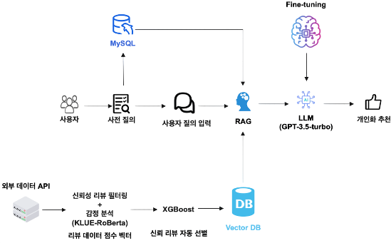

# 개인맞춤형 관광을 위한 LLM 기반 RAG를 활용한 신뢰도 리뷰 추천 시스템
- Personalized Tour AI System (LLM + RAG 기반 맞춤형 관광 추천 시스템)

이 프로젝트는 지역 관광 활성화를 위한 **LLM 기반 맞춤형 추천 시스템**을 구축하는 것을 목표로 합니다.  
특히, **부산 지역 소상공인을 중심으로**, 사용자 맞춤 관광지/맛집/체험을 추천하고,  
리뷰 신뢰도 기반으로 정확하고 신뢰할 수 있는 정보를 제공합니다.


</br>

## 프로젝트 목적

- **부산 소상공인의 급격한 감소** 및 상권 공실률 증가 대응
- 기존 **부산투어패스의 한계**(대형 관광지 중심, 접근성 부족 등) 보완
- 바가지요금, 체류시간 짧음 등 **부산 관광의 구조적 한계 해결**
- **신뢰 리뷰 기반 개인화된 관광 추천**을 통해 지역경제 활성화


</br>

## 핵심 기술 요소

| 기술 | 설명 |
|------|------|
| **LLM (GPT-3.5-turbo)** | 사용자 사전 질의 + 질문을 기반으로 개인화된 응답 생성 |
| **RAG (Retrieval Augmented Generation)** | Vector DB에서 리뷰 정보 검색 후 LLM이 참고 |
| **감정 분석 (KLUE-RoBERTa)** | 리뷰의 감정 극성 점수 추출 |
| **신뢰도 평가 (XGBoost)** | 리뷰의 정량적 지표 기반 신뢰도 라벨 예측 |
| **Vector DB (FAISS)** | 유사도 기반의 의미 검색 지원 |
| **MySQL** | 사용자 사전 질의 정보 저장 (나이, 취향, 여행 목적 등) |


</br>

## 시스템 아키텍처 요약

```plaintext
1. 사용자 사전 질의 수집 (성별, 나이, 관심사 등)
2. 외부 리뷰 수집 (Google Maps, Naver Blog, Instagram 등)
3. 감성 분석 및 정량화 (리뷰 길이, 활동성, 이미지 포함 등)
4. XGBoost 기반 신뢰도 평가 → trust_score ≥ 0.75 → 저장
5. RAG로 Vector DB에서 유사 리뷰 검색
6. LLM이 질의 + 사전 정보 + 리뷰 결과를 바탕으로 개인화된 응답 생성
```



</br>

## 수집 데이터 출처
Google Maps API 리뷰
카카오맵 크롤링 리뷰
네이버 블로그 리뷰 (문화 빅데이터 플랫폼 활용)
Instagram 해시태그 기반 리뷰 크롤링 


</br>

## 기대 효과
- 개인 맞춤형 관광지/맛집/체험 정보 추천
- 신뢰도 높은 리뷰만 기반으로 한 정확한 추천
- 대형 관광지 외 지역 소상공인 매출 증대
- 바가지 요금 예방, 불신 해소
- 지역 경제 활성화 + 타 지역 확장 가능성


</br>

## 폴더 구조(예정)

```bash
📦 personalized-tour-ai
├── 01_data_collection/       # 리뷰 수집 (Google Maps 등)
├── 02_data_cleaning/         # 전처리, 중복 제거
├── 03_sentiment_analysis/    # 감정 분석 모델 추론
├── 04_trust_score_model/     # 정량화 + XGBoost
├── 05_vector_db/             # FAISS / Chroma 저장
├── 06_rag_pipeline/          # RAG 응답 구조
├── 07_llm_response/          # GPT 응답 생성
├── 08_front_ui_mockup/       # 시각화 결과 예시
├── 09_docs/                  # 보고서, 다이어그램
├── image                     # README 사진 
└── README.md
```

</br>

### Git 브랜치 전략

```plaintext
main               ← 최종 안정 버전
│
└── dev            ← 전체 개발 통합 브랜치
     ├── 01_data_collection
     ├── 02_data_cleaning
     ├── 03_sentiment_analysis
     ├── 04_trust_score_model
     ├── 05_vector_db
     ├── 06_rag_pipeline
     ├── 07_llm_response
     ├── 08_front_ui_mockup
     └── 09_docs
```