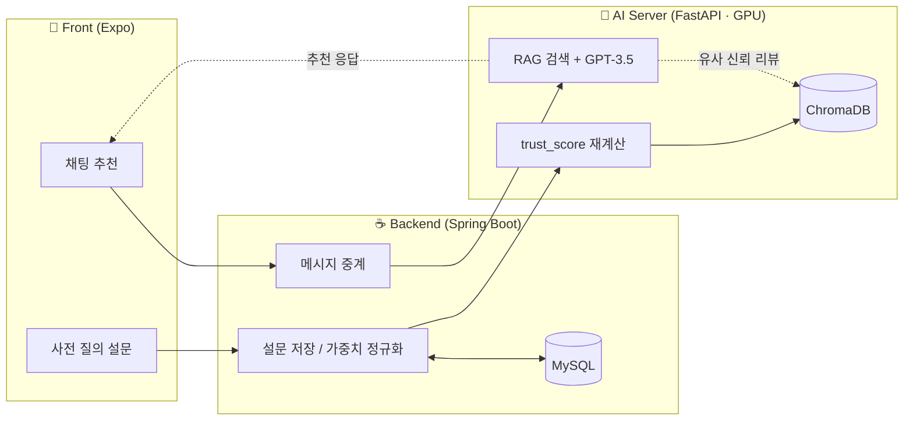

<div align="center">

# 🧳 Personalized Tour AI

### 개인맞춤형 관광을 위한 LLM × RAG 기반 신뢰도 리뷰 추천 시스템

**부산 소상공인 관광 활성화**를 위해, 신뢰할 수 있는 리뷰만 골라
사용자 맞춤 관광지·맛집·체험을 추천하는 AI 시스템입니다.

<br/>


</div>

<br/>

---

## 📑 목차

| | |
|---|---|
| [🎯 프로젝트 개요](#-프로젝트-개요) | [🏗️ 시스템 아키텍처](#️-시스템-아키텍처) |
| [📊 데이터 한눈에 보기](#-데이터-한눈에-보기) | [🔄 처리 파이프라인](#-처리-파이프라인-0106) |
| [🔬 핵심 기술 심화](#-핵심-기술-심화-deep-dive) | [🛠️ 기술 스택](#️-기술-스택) |
| [🚀 실행 방법](#-실행-방법) | [📁 폴더 구조](#-폴더-구조) |

<br/>

---

## 🎯 프로젝트 개요

> 대형 관광지 위주의 기존 관광 서비스와 **신뢰하기 어려운 리뷰** 사이에서,
> "**진짜 믿을 수 있는 리뷰**"만 골라 개인에게 맞는 부산 여행지를 추천합니다.

### 해결하려는 문제

| 문제 | 접근 |
|------|------|
| 🏚️ 부산 소상공인 감소 · 상권 공실률 증가 | 지역 소상공인 중심 추천으로 매출 유도 |
| 🎫 부산투어패스의 한계 (대형 관광지 편중) | 숨은 로컬 맛집·골목 식당 발굴 |
| 💸 바가지요금 · 짧은 체류시간 | 신뢰 리뷰 기반 정확한 정보 제공 |
| 🤔 믿을 수 없는 리뷰 | 정량 지표 + AI로 리뷰 신뢰도 평가 |

### 기대 효과

```
개인 맞춤 추천  ·  신뢰도 높은 정보  ·  지역 소상공인 매출 증대  ·  바가지 예방  ·  타 지역 확장
```

<br/>

---

## 🏗️ 시스템 아키텍처


```mermaid
flowchart LR
    subgraph CLIENT["📱 Front (Expo)"]
        A1[사전 질의 설문]
        A2[채팅 추천]
    end
    subgraph BACK["☕ Backend (Spring Boot)"]
        B1[설문 저장 / 가중치 정규화]
        B2[메시지 중계]
        DB[(MySQL)]
    end
    subgraph AI["🐍 AI Server (FastAPI · GPU)"]
        C1[trust_score 재계산]
        C2[RAG 검색 + GPT-3.5]
        VDB[(ChromaDB)]
    end

    A1 --> B1 --> C1 --> VDB
    A2 --> B2 --> C2
    C2 -.유사 신뢰 리뷰.-> VDB
    C2 -.추천 응답.-> A2
    B1 <--> DB
```

### 동작 흐름 2가지

**① 개인화 (설문 → 벡터 DB 재구축)**
```
설문 제출 → Spring(가중치 정규화) → FastAPI(trust_score 재계산) → ChromaDB 재구축
```

**② 추천 (질문 → RAG → LLM)**
```
질문 입력 → Spring(중계) → FastAPI(유사 리뷰 검색 + GPT-3.5) → 맞춤 추천 응답
```

<br/>

---

## 📊 데이터 한눈에 보기

<div align="center">

| 📦 총 리뷰 | ✅ 신뢰 리뷰 | 📈 신뢰 비율 | 🌐 출처 |
|:---:|:---:|:---:|:---:|
| **97,239건** | **19,257건** | **약 19.8%** | Google Maps · Kakao Maps |

</div>

```
trust_score 분포 ──  min 0.000  │  mean 0.374  │  max 0.993
```

<details>
<summary><b>📋 데이터 스키마 (17개 컬럼)</b></summary>

<br/>

| 분류 | 컬럼 |
|------|------|
| **원본 정보** | `가게명` `업종` `주소` `총평점` `작성자` `리뷰내용` `별점` `작성시간` `리뷰 페이지` `사진유무` `사용자총리뷰수` |
| **정량 점수** | `리뷰길이_점수` `작성자리뷰수_점수` `날짜_최신성_점수` `감정분석_점수` |
| **신뢰도** | `trust_score` `신뢰라벨` |

</details>

<br/>

---

## 🔄 처리 파이프라인 (01~06)

폴더 번호가 곧 처리 단계입니다. 각 단계를 펼쳐서 확인하세요.

<br/>

<details>
<summary><b>1️⃣ &nbsp;01_data_collection — 리뷰 수집 (크롤링)</b></summary>

<br/>

> **Google Places API + Selenium 크롤링**으로 부산 전역 리뷰를 수집

#### 🗺️ Google Maps (3단계)
| 스크립트 | 역할 |
|---------|------|
| `google_reviews_api_1.py` | Places API로 구·군별 좌표 + 17개 키워드 조합 검색 → 리뷰 수집 (반경 5km, `(가게명·주소·작성자)` 중복 제거) |
| `pharse_reviews_2.py` | Selenium으로 **사진유무·총평점·업종·작성자 총리뷰수** 보강 (스크롤 점진 증가, 행마다 저장) |
| `change_value_3.py` | 리뷰 미제공 장소의 결측값을 0으로 보정 |

#### 🗺️ Kakao Maps
| 스크립트 | 역할 |
|---------|------|
| `kakao_reviews.py` | 검색 → 더보기 → 페이지네이션 순회, 리뷰 80개까지 스크롤 로딩 후 추출 |

**수집 키워드(33개 예시):** `해운대 맛집` `감천문화마을 카페` `광안리 카페` `전포 카페` `송정 해수욕장 맛집` `부산 데이트 코스` …

</details>

<details>
<summary><b>2️⃣ &nbsp;02_data_cleaning — 전처리</b></summary>

<br/>

> 두 출처의 데이터를 **통일·정제·병합**

| 스크립트 | 처리 |
|---------|------|
| `google_maps_review_time_change.py` | "3달 전 / 2년 전" 상대시간 → `YYYY.MM.DD` 절대날짜 |
| `kakao_maps_review_change_newline.py` | 리뷰 내 `\n` → 공백 |
| `emoji_data_korean_change.py` | 이모지 30여 종 → 한글 감정어 (😊→기쁨, 😋→맛있음) |
| `Industry_check.py` | 업종 결측 → "없음" |
| `file_duplication_check.py` | `(가게명·작성자·리뷰내용)` 중복 검사 |

</details>

<details>
<summary><b>3️⃣ &nbsp;03_sentiment_analysis — 감정 분석 & 점수화</b></summary>

<br/>

> **KLUE-RoBERTa (NSMC 파인튜닝)** 로 리뷰의 긍정 확률을 추출

#### 길이 적응형 감정 분석 (`sentiment_analysis.py`)
| 토큰 길이 | 처리 방식 |
|:---:|---|
| ≤ 256 | 그대로 추론 |
| 256~512 | 256토큰 청크 분할 → 평균 |
| > 512 | 256토큰 청크 분할 → **길이 가중평균** |

#### 정량 점수화 (`score_vector.py`)
| 점수 | 산출 |
|------|------|
| 리뷰길이 | 100자↓ = 0.0 · 300자↑ = 1.0 (선형) |
| 작성자리뷰수 | 5개↓ = 0.0 · 100개↑ = 1.0 (선형) |
| 최신성 | 365일 기준 선형 감소 |
| 사진유무 | 0 / 1 |

</details>

<details>
<summary><b>4️⃣ &nbsp;04_trust_score_model — 신뢰도 평가 ⭐</b></summary>

<br/>

> 5개 지표를 **가중합**해 trust_score를 만들고, **XGBoost**로 학습

#### trust_score 공식
```
trust_score = 0.20·리뷰길이 + 0.30·작성자수 + 0.25·감정 + 0.20·사진 + 0.05·최신성

신뢰라벨 = 1  if  trust_score ≥ 0.6   else  0
```

#### XGBoost 학습
- **X** = `[리뷰길이, 작성자수, 최신성, 감정, 사진]` &nbsp;/&nbsp; **y** = `신뢰라벨`
- 8:2 분할 → `XGBClassifier(eval_metric='logloss')` → `xgb_trust_model.pkl` 저장
- 규칙으로 만든 라벨을 모델이 일반화 → 신규 리뷰를 5개 지표만으로 예측

| 버전 | 신뢰(1) | 비신뢰(0) | 평균 |
|------|:---:|:---:|:---:|
| V1 | 17,761 | 79,478 | 0.390 |
| V2 | 19,257 | 77,982 | 0.374 |

</details>

<details>
<summary><b>5️⃣ &nbsp;05_vector_db — 벡터 DB 구축</b></summary>

<br/>

> 신뢰 리뷰만 임베딩해 **ChromaDB**에 의미 검색용으로 저장

```
신뢰 리뷰 필터 → multilingual-e5-base 임베딩("passage:") → ChromaDB 저장
                                                    검색 시 "query:" prefix
```

- 임베딩 모델: `intfloat/multilingual-e5-base` (비대칭 검색용 prefix 필수)
- 메타데이터: `가게명·별점·작성자·총리뷰수·총평점·주소·리뷰 페이지·trust_score`

</details>

<details>
<summary><b>6️⃣ &nbsp;06_front_backend_rag_pipeline — 풀스택 RAG</b></summary>

<br/>

> **3개 컨테이너**(Expo · Spring Boot · FastAPI)가 연동

#### 📱 front_app (React Native / Expo)
| 화면 | 역할 |
|------|------|
| `(tabs)/index.tsx` | 채팅방 목록 조회·생성 |
| `query_detail/new.tsx` | 사전 질의 설문(나이·동행·목적 + 신뢰도 5문항 + 임계값) |
| `chat/[roomId].tsx` | 채팅 UI, BOT 응답의 리뷰 링크 렌더 |

#### ☕ backend_app (Spring Boot + JPA + MySQL)
| API | 기능 |
|-----|------|
| `POST /queries/create` | 설문 저장 → 가중치 정규화 → 벡터 DB 재구축 트리거 |
| `POST /api/chat/send` | 메시지 저장 → FastAPI 중계 → 추천 응답 저장 |
| `POST /signup` `/signin` | 회원 |

#### 🐍 python_api (FastAPI · GPU)
| 엔드포인트 | 기능 |
|-----------|------|
| `POST /update-trust-score` | trust_score 재계산 → 신뢰리뷰 재임베딩 → 컬렉션 재생성 |
| `POST /llm-recommend` | top-3 유사 리뷰 검색 → 프롬프트 구성 → GPT-3.5 호출 |

</details>

<br/>

---

## 🔬 핵심 기술 심화 (Deep Dive)

<br/>

### 🧮 1. XGBoost 신뢰도 모델

```python
X = df[['리뷰길이_점수', '작성자리뷰수_점수', '날짜_최신성_점수', '감정분석_점수', '사진유무']]
y = df['신뢰라벨']
X_train, X_test, y_train, y_test = train_test_split(X, y, test_size=0.2, random_state=42)

model = XGBClassifier(use_label_encoder=False, eval_metric='logloss')
model.fit(X_train, y_train)
joblib.dump(model, 'xgb_trust_model.pkl')
```

> 💡 **설계 의도** — `신뢰라벨`은 `trust_score ≥ 0.6` 규칙으로 먼저 생성되고, XGBoost는 그 규칙을 데이터로 학습합니다. 즉 모델은 *"가중합 규칙의 근사기"* 이며, 신규 리뷰를 5개 지표만으로 빠르게 판정하기 위함입니다.

⚠️ **유의점** — 신뢰(19.8%) vs 비신뢰(80.2%)의 **클래스 불균형**이 크므로, accuracy만이 아니라 `classification_report`(precision/recall/f1)를 함께 봅니다. → 개선: `scale_pos_weight`, 교차검증, feature importance 분석.

<br/>

### 💬 2. RAG 프롬프트 구성

```python
query_embedding = model.encode(f"query: {message}")                # E5 query prefix
results = collection.query(query_embeddings=[query_embedding], n_results=3)   # top-3
prompt  = build_prompt(survey, results['documents'][0], results['metadatas'][0], message)

completion = client.chat.completions.create(
    model="gpt-3.5-turbo",
    messages=[
        {"role": "system", "content": "너는 부산 여행지 추천 도우미야."},
        {"role": "user",   "content": prompt},
    ],
)
```

**프롬프트 템플릿**
```
사용자 정보:
- 나이대 / 동행 유형 / 여행 목적

추천 기반 유사 리뷰 3개:
[가게명] 주소 · 별점/총평점 · 작성자(총리뷰수) · trust_score · 리뷰 페이지 · 리뷰 내용
===  (리뷰 3개 반복)

사용자 질문: {질문}
→ 위 데이터를 기반으로 부산 여행지 3곳을 추천해줘.
```

> 💡 **개인화 = 사전 설문 + RAG 신뢰 리뷰**. 리뷰 페이지 URL과 `trust_score`를 함께 주입해, LLM 응답에 **원본 링크**와 신뢰 근거가 담기도록 유도합니다.

<br/>

### 🔁 3. 벡터 DB 재구축 (개인화 핵심)

사용자가 "어떤 리뷰를 신뢰하는가"를 선택 → 그 선호가 **가중치**가 되어 벡터 DB가 사용자에 맞게 재구축됩니다.

```
설문 제출
 └─ Spring : 5개 선호도 → 0이면 기본값 대체 → 합=1로 정규화 → POST /update-trust-score
     └─ FastAPI
         ① trust_score 재계산 (Σ 가중치 × 점수)
         ② 신뢰라벨 재부여 (≥ threshold)
         ③ 신뢰리뷰만 "passage:" prefix
         ④ e5 임베딩 (500개 배치 · CUDA)
         ⑤ 기존 컬렉션 삭제 → 재생성 → 배치 삽입
```

```python
df["trust_score"] = (
    w["reviewLength"]*df["리뷰길이_점수"] + w["reviewCount"]*df["작성자리뷰수_점수"] +
    w["sentiment"]*df["감정분석_점수"]   + w["photo"]*df["사진유무"] +
    w["recentness"]*df["날짜_최신성_점수"]
).round(3)
df["신뢰라벨"] = df["trust_score"].apply(lambda x: 1 if x >= threshold else 0)
```

> 💡 가중치를 **합=1로 정규화**해 어떤 조합이든 trust_score 스케일(0~1)을 유지. 임베딩·삽입은 **500개 배치**로 OOM/요청 한도 회피.
>
> ⚠️ 매 설문마다 신뢰 리뷰(~2만 건) 전체를 재임베딩하므로 비용이 큼 → 앱의 *"리뷰 데이터 최적화 중"* 모달이 대기시간을 가립니다. 개선: 사용자별 컬렉션 분리 · 임베딩 캐시 · 증분 갱신.

<br/>

---

## 🛠️ 기술 스택

| 영역 | 사용 기술 |
|------|----------|
| **수집** | Python · Google Places API · Selenium |
| **전처리** | pandas · dateutil |
| **감정 분석** | KLUE-RoBERTa (NSMC fine-tuned) · transformers · PyTorch |
| **신뢰도 모델** | XGBoost · scikit-learn · joblib |
| **임베딩 / 검색** | sentence-transformers (`multilingual-e5-base`) · ChromaDB |
| **LLM** | OpenAI GPT-3.5-turbo |
| **프론트엔드** | React Native · Expo Router · axios |
| **백엔드** | Spring Boot · Spring Data JPA · MySQL · Lombok |
| **AI 서버** | FastAPI · uvicorn |
| **인프라** | Docker (3 컨테이너) · AWS EC2 (GPU · CUDA 12.1) |

<br/>

---

## 🚀 실행 방법

> ⚠️ 일부 스크립트에 경로(`C:/Users/...`, `/Users/...`)가 하드코딩되어 있어 재현 시 수정이 필요합니다. (협업 중 Windows/Mac 환경 혼재)

**데이터 파이프라인 (01 → 05)**
```bash
python 01_data_collection/google_maps/google_reviews_api_1.py   # 수집
python 02_data_cleaning/google_maps_review_time_change.py        # 전처리
python 03_sentiment_analysis/sentiment_analysis.py               # 감정/정량화
python 04_trust_score_model/trust_score.py                       # trust_score
# 05_vector_db/vector_db.ipynb 실행                               # 벡터 DB
```

**서비스 (06)**
```bash
# 🐍 FastAPI (RAG + LLM)
cd 06_front_backend_rag_pipeline/python_api && uvicorn main:app --host 0.0.0.0 --port 8000

# ☕ Spring Boot
cd 06_front_backend_rag_pipeline/backend_app && ./gradlew bootRun

# 📱 Expo
cd 06_front_backend_rag_pipeline/front_app && npx expo start
```

**환경변수** : `GOOGLE_API_KEY` · `OPENAI_API_KEY` · `FILE_PATH` (`.env`)
각 디렉터리에 `dockerfile` 포함 (docker-compose는 없음 · EC2 수동 구성)

<br/>

---

## 📁 폴더 구조

```bash
personalized-tour-ai
├── 01_data_collection/            # 🗺️  리뷰 수집 (Google API / Kakao 크롤링)
├── 02_data_cleaning/              # 🧹  전처리 (시간·개행·이모지·업종·중복)
├── 03_sentiment_analysis/         # 💚  KLUE-RoBERTa 감정 분석 + 점수화
├── 04_trust_score_model/          # ⭐  trust_score 가중합 + XGBoost
├── 05_vector_db/                  # 🔍  multilingual-e5 임베딩 + ChromaDB
├── 06_front_backend_rag_pipeline/ # 🧩  RAG 풀스택
│   ├── front_app/                 #     📱 React Native (Expo)
│   ├── backend_app/               #     ☕ Spring Boot + JPA + MySQL
│   └── python_api/                #     🐍 FastAPI (RAG + LLM)
├── image/                         # 🖼️  README 이미지
└── README.md
```

<br/>

<div align="center">

**🏫 졸업작품 프로젝트** &nbsp;·&nbsp; Personalized Tour AI

<sub>신뢰할 수 있는 리뷰로, 당신에게 꼭 맞는 부산 여행을.</sub>

</div>
